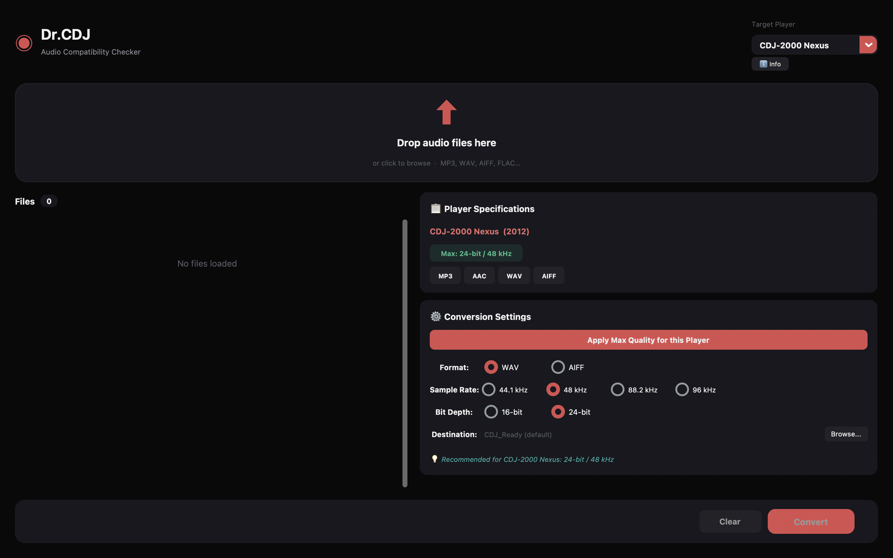

<div align="center">


# Dr. CDJ

**Audio Compatibility Checker & Converter for Pioneer CDJ Players**

[](https://github.com/IndigoAutomation/DR-CDJ/releases)
[](https://python.org)
[](LICENSE)
[]()
[](https://ffmpeg.org)

[**Download for macOS →**](https://github.com/IndigoAutomation/DR-CDJ/releases/latest)

</div>

---

<div align="center">



</div>

---

## What is Dr. CDJ?

Dr. CDJ is a macOS app that instantly checks whether your audio files will play correctly on Pioneer CDJ players — and converts them when they won't.

Drop a folder of tracks before a gig. In seconds you'll know exactly which files need converting and why. One click converts them all to the highest quality the player supports.

No more "unsupported format" surprises at the club.

---

## Features

| | |
|---|---|
| **Multi-player support** | CDJ-2000 Nexus, CDJ-2000 NXS2, CDJ-3000, XDJ-1000 MK2, XDJ-700 |
| **Instant analysis** | Checks codec, sample rate, bit depth, and bitrate via ffprobe |
| **Smart conversion** | Automatically picks the best format and quality for your target player |
| **Batch processing** | Drop an entire folder — all files checked and converted in one go |
| **Drag & drop** | Works with files and folders |
| **Dark interface** | Designed for low-light DJ booths |

---

## Supported Formats

| Format | Playback | Conversion target |
|--------|----------|-------------------|
| MP3 | ✅ Native | — |
| AAC / M4A | ✅ Native | — |
| WAV | ✅ Native | ✅ 24-bit / 96 kHz |
| AIFF | ✅ Native | ✅ 24-bit / 96 kHz |
| FLAC | ⚠️ Not supported | → WAV/AIFF |
| OGG / Opus | ⚠️ Not supported | → WAV/AIFF |
| WMA / ALAC | ⚠️ Not supported | → WAV/AIFF |

---

## Installation

### macOS App (recommended)

1. Download `Dr-CDJ-macOS.dmg` from [Releases](https://github.com/IndigoAutomation/DR-CDJ/releases/latest)
2. Open the DMG and drag **Dr. CDJ** to Applications
3. Launch it — FFmpeg downloads automatically on first run

### From source

**Requirements:** Python 3.11+, FFmpeg 6.x+

```bash
git clone https://github.com/IndigoAutomation/DR-CDJ.git
cd DR-CDJ
pip install -r requirements.txt
pip install -e .
dr-cdj
```

---

## How to use

1. Select your **Target Player** from the dropdown (top right)
2. Drag audio files or a folder into the drop zone
3. Check the results — compatible files are green, incompatible ones are flagged
4. Click **Convert** to batch-convert all flagged files
5. Converted files land in a `CDJ_Ready/` folder next to the originals

---

## CDJ Compatibility Reference

| Player | Max Quality | Native Formats |
|--------|-------------|----------------|
| CDJ-2000 Nexus | 24-bit / 48 kHz | MP3, AAC, WAV, AIFF |
| CDJ-2000 NXS2 | 24-bit / 96 kHz | MP3, AAC, WAV, AIFF |
| CDJ-3000 | 32-bit / 96 kHz | MP3, AAC, WAV, AIFF, FLAC |
| XDJ-1000 MK2 | 24-bit / 96 kHz | MP3, AAC, WAV, AIFF |
| XDJ-700 | 24-bit / 48 kHz | MP3, AAC, WAV, AIFF |

---

## Architecture

```
src/dr_cdj/
├── main.py             # Entry point
├── config.py           # CDJ profiles and format definitions
├── analyzer.py         # Audio metadata via ffprobe
├── compatibility.py    # Per-profile compatibility engine
├── converter.py        # FFmpeg conversion logic
├── gui.py              # CustomTkinter UI
└── splash.py           # Splash screen
```

---

## Development

```bash
git clone https://github.com/IndigoAutomation/DR-CDJ.git
cd DR-CDJ
pip install -e ".[dev]"

# Run
python -m dr_cdj.main

# Test
pytest

# Lint
ruff check src/

# Build macOS app
python scripts/download-ffmpeg.py   # embed FFmpeg
python build.py                     # PyInstaller → dist/Dr-CDJ.app
bash create-dmg.sh                  # package DMG
```

---

## Contributing

Contributions are welcome. See [CONTRIBUTING.md](CONTRIBUTING.md) for guidelines.

---

## License

MIT — see [LICENSE](LICENSE).

> Pioneer and CDJ are registered trademarks of Pioneer Corporation. This project is not affiliated with Pioneer.
